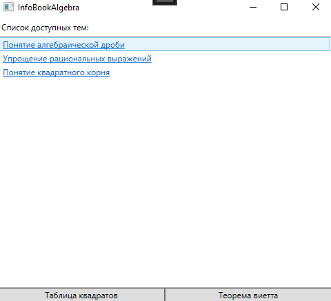
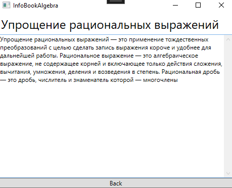

# Информационная система по школьному предмету "Алгебра"

## 1. Описание проекта
Данный проект предназначен для простого изучения тем по школькому предмету "Алгебра" из одного приложения.

---

## 2. Функциональность
- Просмотр списка тем
- Выбор темы
- Отображение содержания темы
- Решение теоремы Виетта

---

## 3. Архитектура проекта
Тип архитектуры: клиентское приложение с прямым подключением к базе данных.

**Технологии:**
- C#
- WPF (MVVM)
- Entity Framework Core
- PostgreSQL
- NUnit

**Структура проекта:**
- `docs/` — документация
- `InfoBookAlgebra/` — WPF приложение
- `InfoBookAlgebra.Core/` — ядро для приложения
- `InfoBookAlgebra.Tests/` — тесты

---

## 4. Установка и запуск

**Требования:**
- .NET 8+
- Оперативная память: не менее 1 ГБ
- Свободное место на диске: 200 МБ
- СУБД: PostgreSQL
- Для разработки: Visual Studio 2022 (рекомендуется) либо любой редактор с поддержкой C#

**Установка:**
```bash
git clone https://github.com/u-Kotovsky/info-book-algebra.git
cd info-book-algebra
dotnet restore
```

**Запуск:**
```bash
dotnet build
dotnet run --project InfoBookAlgebra
```

---

## 5. Использование
После запуска системы пользователь может:
- просматривать список тем
- выбирать тему
- анализировать выбранную тему

---

## 6. Демонстрация
- Скриншоты интерфейса представлены в папке `docs/`

<figure>
    
    <figcaption>Рисунок 1 - Физическая структура базы данных</figcaption>
</figure>
<br>
<figure>
    
    <figcaption>Рисунок 2 - Содержание</figcaption>
</figure>
<br>
<figure>
    
    <figcaption>Рисунок 3 - Тема 1</figcaption>
</figure>
<br>
<figure>
    
    <figcaption>Рисунок 4 - Тема 2</figcaption>
</figure>

---


## 7. Тестирование
Для запуска тестов:
```bash
dotnet test
```

Типы тестов:
- модульные

---

## 8. Автор
Студент: Левченко Дмитрий Александрович
Группа: ИСП-9  
Специальность: 09.02.07 Информационные системы и программирование  

Руководитель: Дмитриев А.А.

Контакты:
- email: id.u.kotovsky@gmail.com
- GitHub: https://github.com/u-Kotovsky


# LICENSE
Проект разработан в учебных целях.
