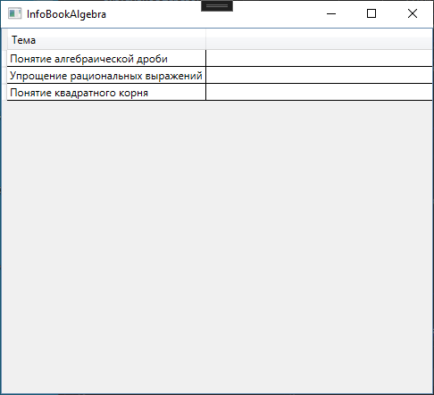
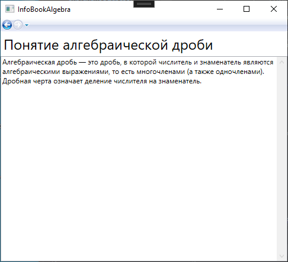
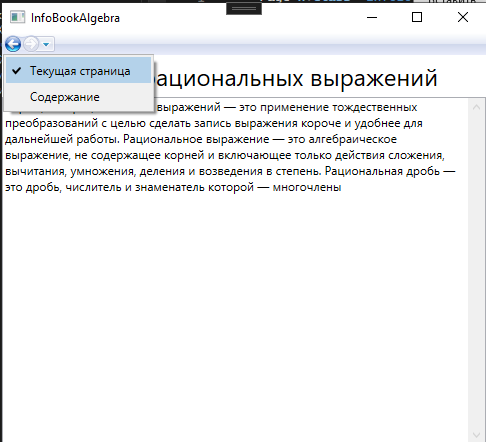

# InfoBookAlgebra

TODO: 
- [x] description of project
- [ ] 3-4 named screenshots
- [x] remove bin/Release from ignore (WHY?)

Информационная система по школьному предмету "Алгебра"
Данный проект предназначен для простого изучения тем по школькому предмету "Алгебра" из одного приложения.

# Screenshots

<figure>
    
    <figcaption>Рисунок 1 - Физическая структура базы данных</figcaption>
</figure>
 
<figure>
    
    <figcaption>Рисунок 2 - Содержание</figcaption>
</figure>
 
<figure>
    
    <figcaption>Рисунок 3 - Тема 1</figcaption>
</figure>
 
<figure>
    
    <figcaption>Рисунок 4 - Меню навигации</figcaption>
</figure>
 
# LICENSE

MIT